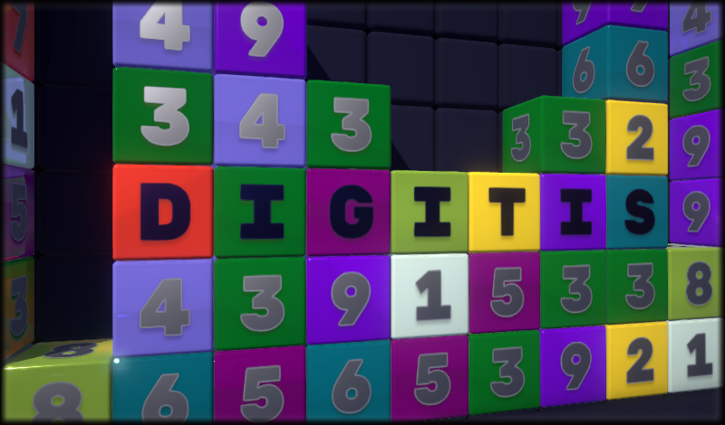
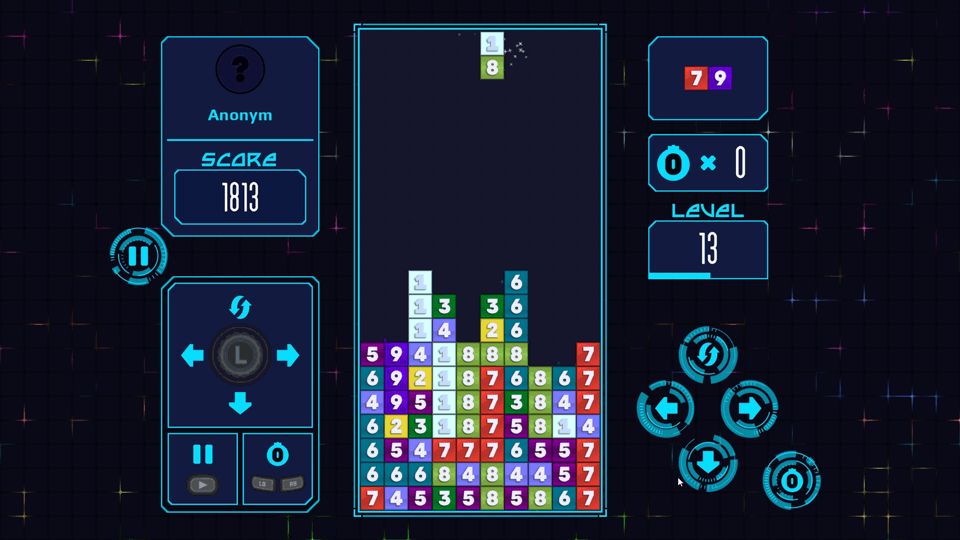

 

> Digitis is a game that combines Tetris and match-three mechanics. The difficulty level can be adjusted to suit everyone, so everyone can find their own comfortable game mode.
>> The goal of the game is to arrange blocks of digits into clusters according to their value. The cluster contains blocks that are adjacent in a straight line (top, left, bottom, right). To remove a group of 2s, you only need two blocks, a group of 3s - three blocks, and so on up to 9s - there must be at least nine of them. When a cluster is deleted, all adjacent 1s and their clusters are destroyed. 
>> Points are awarded for each block removed according to its value. 1s score points based on the value of the cluster they join. 
>> You can replace all the blocks of the next shape with Zero-Bombs. When the Zero-Bomb comes to a stop, it will explode and destroy blocks (without scoring any points) within a radius of two cells in a straight line and one cell in a diagonal line. 

 

 

 

